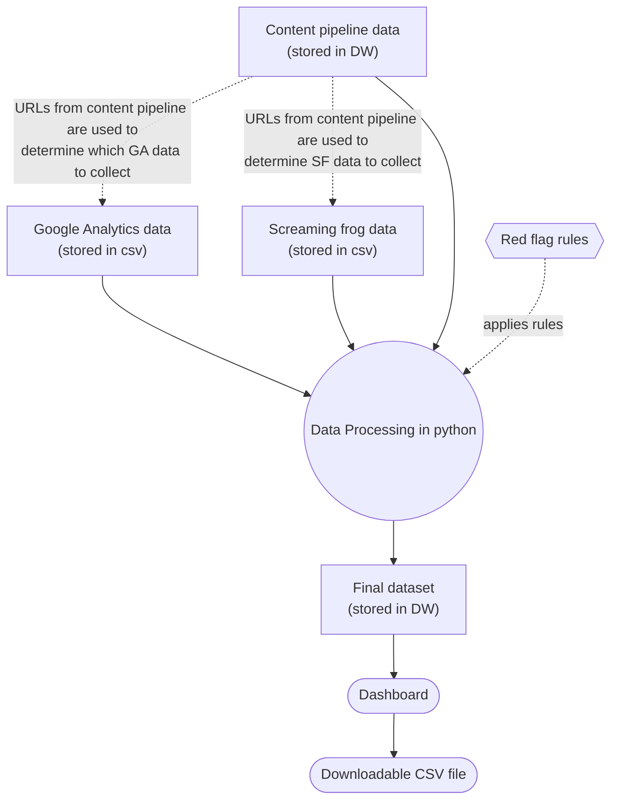

## Architecture
### Description of overall system design

```mermaid
flowchart TD

    %% Core sources
    A["Content pipeline data<br/>(stored in DW)"]
    B["Google Analytics data<br/>(stored in csv)"]
    C["Screaming frog data<br/>(stored in csv)"]
    E((Data Processing in python))

    %% Rules (parallel influence)
    D{{Red flag rules}}

    %% Outputs
    F["Final dataset<br/>(stored in DW)"]
    G([Dashboard])
    H([Downloadable CSV file])

    %% Note about URLs
    A -.URLs from content pipeline are used to<br/>determine which GA data to collect.-> B
    A -.URLs from content pipeline are used to<br/>determine SF data to collect.-> C

    B --> E
    C --> E
    A --> E

    %% Rules influence
    D -. applies rules .-> E

    %% Outputs
    E --> F
    F --> G
    G --> H
```
